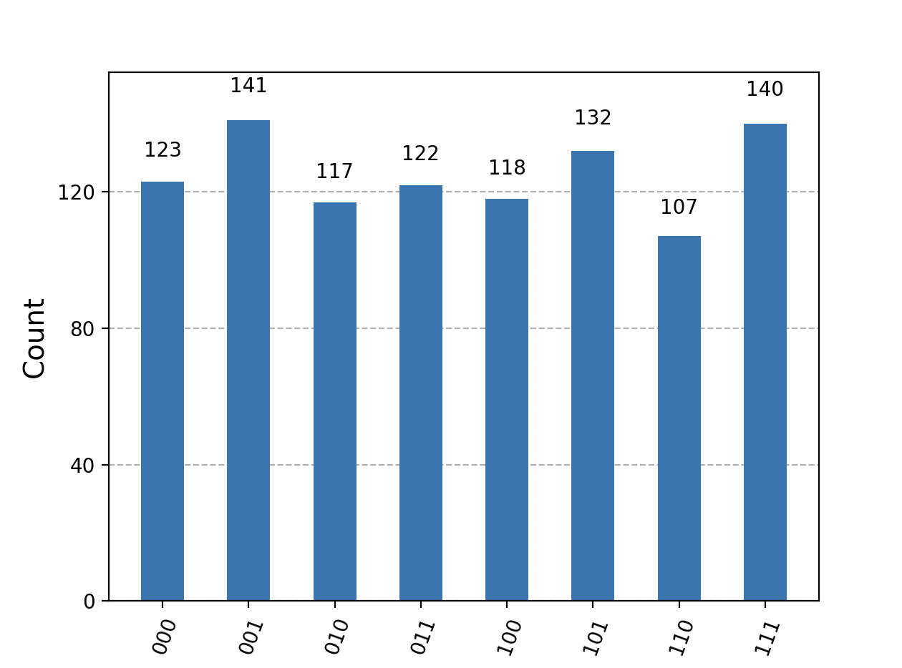

# Quantum Random Number Generator

This project implements a Quantum Random Number Generator (QRNG) using Qiskit. It utilizes quantum superposition to generate truly random numbers based on quantum mechanics.

## 📌 Features

- Uses a 3-qubit quantum circuit to generate random 3-bit numbers.
- Uses Hadamard gates to create equal probability distributions.
- Runs on the Qiskit Aer simulator.
- Displays a histogram of the generated numbers.

## 🛠️ Requirements

Ensure you have the following installed:
- Python (>=3.8)
- Qiskit (>=1.0)
- Matplotlib (for visualization)

To install dependencies, run:
pip install qiskit matplotlib

## 📜 Code Explanation

1. Quantum Circuit Creation:

- A 3-qubit, 3-classical-bit circuit is created.
- Each qubit is placed into superposition using Hadamard gates.

2. Measurement: The qubits are measured and converted into binary numbers.

3. Execution: The circuit runs on the Qiskit Aer simulator.

4. Visualization: The results are plotted using a histogram.

## 📊 Output

## 🔢 Entropy Calculation
To verify randomness, we calculated the **Shannon entropy** of the generated numbers:

## 🏗️ Future Enhancements

- Increase the number of qubits for higher-bit random numbers.
- Implement a GUI for better user interaction.
- Use a real quantum computer instead of a simulator.

## 📜 License
This project is licensed under the MIT License.

